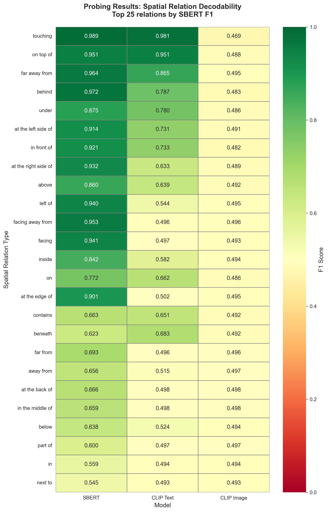
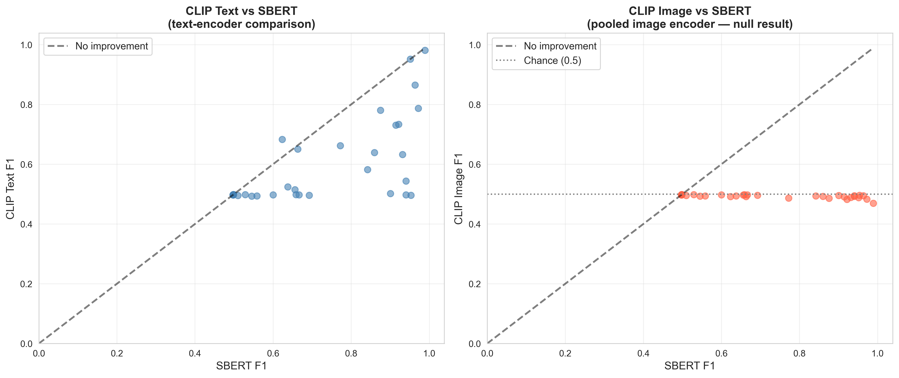
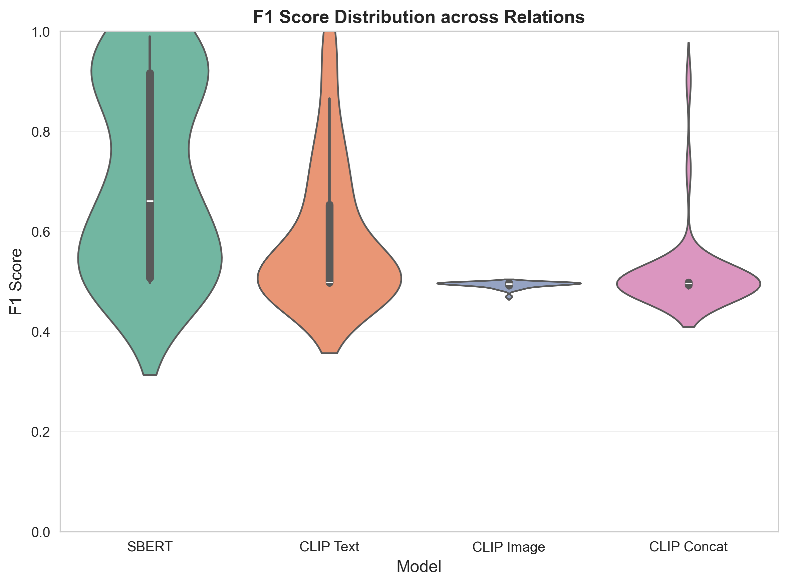
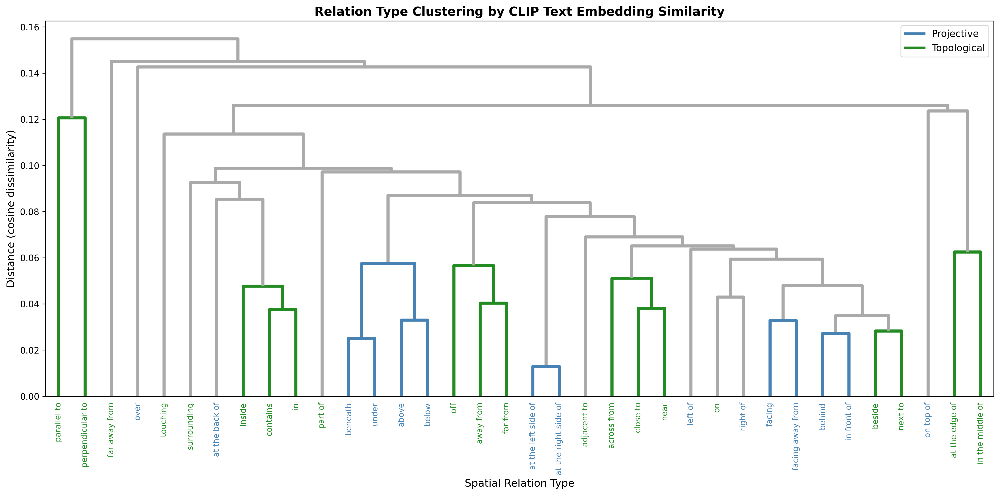

# Spatial Reasoning Probing Study — Study 1

**Does visual training help language models understand space?**

One known weakness of language models is spatial reasoning. Having learned from text alone, they have no perceptual grounding for concepts like *above*, *left of*, or *inside* — they've only ever seen these words in context, never experienced what they refer to.

CLIP changes the training regime: instead of predicting masked tokens, it learns to align image-caption pairs. The hypothesis here is that this contrastive visual training leaves a residue in the text embedding space — making spatial relations more linearly decodable, even when no image is present at inference time.

This study tests that hypothesis using **probing classifiers**: lightweight logistic regression models trained on frozen embeddings to ask whether spatial relation labels are linearly decodable from each representation.

> *N.B. I am disclosing that I used AI (Claude Code) to assist with coding in this project, as encouraged in the course. Research design, experimental decisions, and interpretation of results are my own.*

---

## Research Question

> Does visual contrastive training (CLIP) produce text embeddings that encode spatial relations better than purely distributional training (SBERT)? And which specific relation types benefit — or remain resistant?

---

## Results

### Mean F1 by Model (36 relations, min 50 examples)

| Model | Mean F1 |
|---|---|
| SBERT (`all-mpnet-base-v2`) | 0.710 |
| CLIP Text encoder | 0.589 |
| CLIP Concat (image + text, 1024d) | 0.514 |
| CLIP Image encoder | 0.493 |

### Main Results Heatmap



### CLIP Text vs SBERT / CLIP Image



### F1 Distribution across Models



### Relation Type Clustering (by CLIP Text Embedding Similarity)



---

## Models

| Model | Type | Training Objective | Visual Signal |
|---|---|---|---|
| `sentence-transformers/all-mpnet-base-v2` | SBERT | NLI + semantic similarity | None |
| `openai/clip-vit-base-patch32` (text encoder) | CLIP Text | Contrastive image-text | Indirect |
| `openai/clip-vit-base-patch32` (image encoder) | CLIP Image | Contrastive image-text | Direct |
| CLIP text + image (concat, 1024d) | CLIP Concat | Contrastive image-text | Both |

---

## Dataset

**VSR — Visual Spatial Reasoning** (Liu et al., 2022)
- ~7,680 training examples (image, caption, relation type, True/False label)
- 64 relation types; 36 retained after filtering relations with fewer than 50 examples
- Images are COCO images fetched at runtime; only filenames stored in the HuggingFace dataset

---

## Reproducing the Results

### Environment

```bash
git clone https://github.com/nogully/spatial_probing.git
cd spatial_probing
python -m venv .venv && source .venv/bin/activate
pip install -r requirements.txt
```

### Embedding Extraction (Google Colab — GPU required)

You will need:
- A **GitHub Personal Access Token** (to clone the repo in Colab)
- A **HuggingFace token** (to suppress rate-limit warnings when downloading models)

Open `notebooks/02_embedding_extraction.ipynb`, run the Colab setup cell (mounts Drive, clones repo, installs deps), then run all cells. Embeddings are cached to Google Drive as `.npy` files.

Sync the following files to `results/embeddings/` locally before running probing:
- `sbert_vsr_train.npy`
- `clip_text_vsr_train.npy`
- `clip_image_vsr_train.npy`
- `clip_concat_vsr_train.npy`

### Probing and Visualization (local)

Run notebooks 03–05 locally in order:

```
notebooks/03_probing_experiments.ipynb   # trains probes, saves CSVs
notebooks/05_visualization.ipynb         # all publication figures
```

---

## Project Structure

```
spatial_probing/
├── README.md
├── requirements.txt
├── .env                         # gitignored — set CACHE_DIR here
│
├── notebooks/
│   ├── 01_data_exploration.ipynb
│   ├── 02_embedding_extraction.ipynb    # run on Colab
│   ├── 03_probing_experiments.ipynb
│   └── 05_visualization.ipynb
│
├── src/
│   ├── datasets.py              # VSR loader
│   ├── embedders.py             # SBERT, CLIP text, image, concat embedders
│   └── probing.py               # logistic regression probe + CV
│
└── results/
    ├── embeddings/              # cached .npy files — gitignored
    └── figures/                 # output plots
```

---

## References

- Radford et al. (2021) — CLIP: [Learning Transferable Visual Models From Natural Language Supervision](https://arxiv.org/abs/2103.00020)
- Reimers & Gurevych (2019) — SBERT: [Sentence-BERT](https://arxiv.org/abs/1908.10084)
- Liu et al. (2022) — VSR: [Visual Spatial Reasoning](https://arxiv.org/abs/2205.00363)
- Belinkov (2022) — [Probing Classifiers: Promises, Shortcomings, and Advances](https://direct.mit.edu/coli/article/48/1/207/107571)
- Tong et al. (2024) — [Eyes Wide Shut? Exploring the Visual Shortcomings of Multimodal LLMs](https://arxiv.org/abs/2401.06209)

---

## Author

Nora Gully — University of Colorado Boulder, CSCI 4622 Machine Learning, Spring 2026
